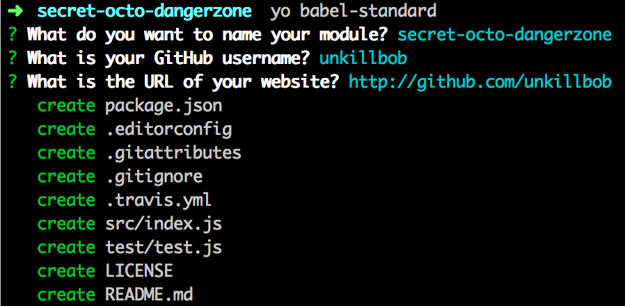

# generator-babel-standard
[![travis][travis-image]][travis-url]
[![npm][npm-image]][npm-url]
[![js-standard-style][standard-style-image]][standard-style-url]

[travis-image]: https://img.shields.io/travis/unkillbob/generator-babel-standard.svg?style=flat
[travis-url]: https://travis-ci.org/unkillbob/generator-babel-standard
[npm-image]: https://img.shields.io/npm/v/generator-babel-standard.svg?style=flat
[npm-url]: https://npmjs.org/package/generator-babel-standard
[standard-style-image]: https://img.shields.io/badge/code%20style-standard-brightgreen.svg?style=flat
[standard-style-url]: https://github.com/feross/standard

> [Yeoman](http://yeoman.io) generator for simple node modules with [babel](https://github.com/babel/babel) transpiling and code style with [feross/standard](https://github.com/feross/standard).

## Getting Started

Install [Yeoman](http://yeoman.io):

```bash
npm install -g yo
```

Install `generator-babel-standard`:

```bash
npm install -g generator-babel-standard
```

Finally, initiate the generator:

```bash
yo babel-standard
```



## Credits

- Generator heavily inspired by / borrowed from [sindresorhus' generator-nm](https://github.com/sindresorhus/generator-nm).
- npm script style tooling inspired by [substack's task automation with npm run](http://substack.net/task_automation_with_npm_run)

## License

MIT © [James Bunt](http://github.com/unkillbob)
